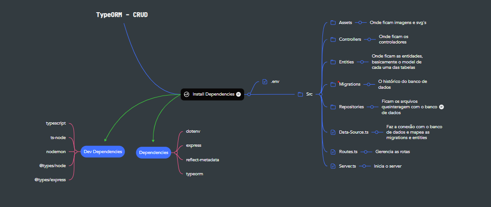
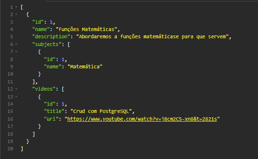

# TypeORM - CRUD

Basicamente consiste em um CRUD em que podemos visualizar, adicionar, editar e deletar 
elementos em um sistema universitário simples. 

Temos uma tabela para as salas que possuem em seu interior videoaulas e essas aulas 
possuem relação com uma tabela de matérias 

Criei esse projeto com o objetivo de aprender sobre o uso do TypeORM com Typescript e também 
relembrar comandos básicos da linguagem SQL.

<h2>Estrutura</h2>

<h2>Retorno</h2>

 

<h2>Dependencias</h2>

✅ dotenv 
✅ express 
✅ pg 
✅ reflect-metadata 
✅ typeorm

<h2>Dependencias de Desenvolvimento</h2>

✅ typescript 
✅ nodemon 
✅ ts-node 
✅ @types/express 
✅ @types/node
